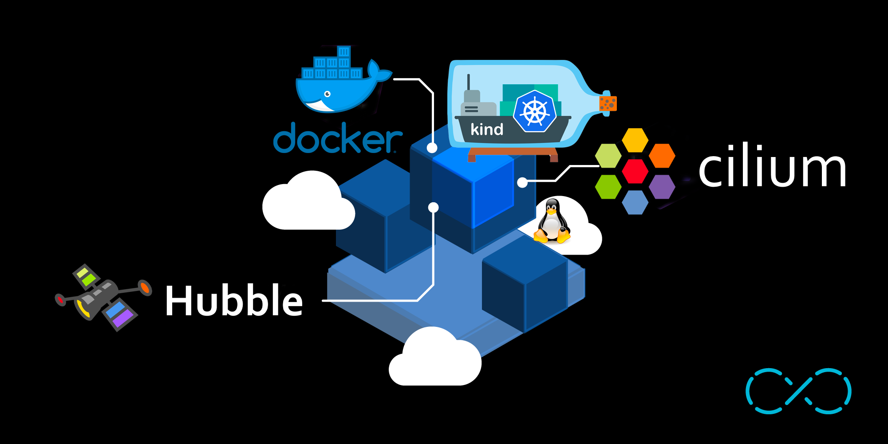
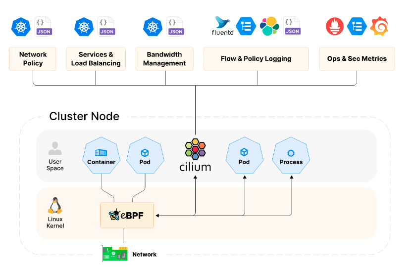
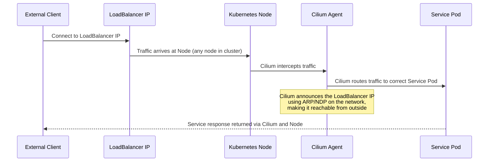
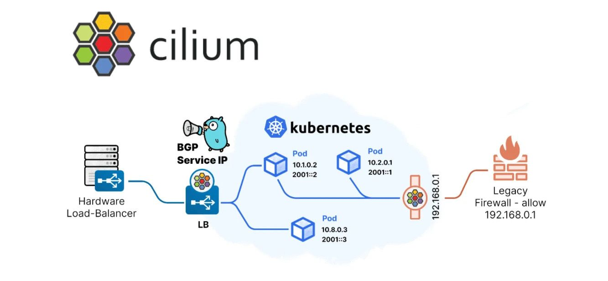

 


 # Kubernetes Test Platform with Kind and Cilium
 

> This guide walks you through setting up a local Kubernetes cluster using [Kind](https://kind.sigs.k8s.io/) and [Cilium](https://cilium.io/) for advanced networking and observability.


---

## 🚀 Why Kind?

**Kind** is a tool for running local Kubernetes clusters using Docker containers. It is primarily used for development, testing, and learning Kubernetes.


### What is Kind Used For?
- **Local Development and Testing**: Ideal for creating Kubernetes clusters on a local machine.
- **Speed and Lightweight**: Uses Docker containers to simulate Kubernetes nodes, making it fast and resource-efficient.
- **Compatibility**: Supports recent versions of Kubernetes, allowing you to test advanced features or multi-node configurations.


### How Does Kind Work?
Kind creates each Kubernetes node as a Docker container. It uses a special Docker image, called a *node image*, which contains all the components needed to run a Kubernetes node (e.g., kubelet, containerd).


### Typical Use Cases
- **Testing Applications**: Deploy and test applications in a local Kubernetes environment before moving them to production.
- **Developing Kubernetes Operators**: Often used to develop and test Kubernetes operators.
- **Learning Kubernetes**: Perfect for practicing Kubernetes operations without needing a cloud environment.
- **Continuous Integration (CI)**: Integrated into CI pipelines to run tests on ephemeral Kubernetes clusters.
- **No Cloud Costs** – Everything runs locally, avoiding cloud infrastructure expenses.
- **Reproducible** – Easily reset and redeploy clusters for testing.
- **Multi-node Support** – Test distributed workloads and cluster topologies locally.

---

## 🐝 Why Cilium?

Cilium is a modern Container Network Interface (CNI) that leverages eBPF (extended Berkeley Packet Filter) technology for providing high-performance networking, security, and observability in cloud-native environments. Some of the key advantages of using Cilium include:
- **Enhanced Security:** Cilium offers advanced security features, including identity-based policies and layer 7 traffic filtering, allowing for fine-grained control over microservices communication.
- **Performance Efficiency:** By utilizing eBPF, Cilium can achieve more efficient networking by processing data at the kernel level, reducing overhead and improving overall throughput.
- **Visibility and Monitoring:** Cilium provides deep visibility into network traffic, helping to monitor and troubleshoot application performance with features such as packet capture and real-time metrics.
- **Support for Cloud-Native Architectures:** Designed specifically for Kubernetes and cloud-native applications, Cilium integrates seamlessly with existing workloads while also supporting service mesh architectures.
- **Dynamic Load Balancing:** Cilium offers built-in load balancing capabilities that are based on real-time traffic patterns, enhancing the responsiveness and reliability of applications.

In summary, incorporating Cilium as your CNI brings significant performance and security benefits that are essential for modern, scalable cloud-native applications.



---

## 📋 Prerequisites

- Installed Docker (Engine), Podman, or nerdctl
- Installed kubectl (command line tool for Kubernetes API)

---

## 🛠️ Kind installation

There are several options to install Kind. If you are a Go developer, the [Go installation method ](https://kind.sigs.k8s.io/docs/user/quick-start/#installing-with-go-install)might suit you well. Otherwise, pre-compiled [binaries](https://kind.sigs.k8s.io/docs/user/quick-start/#installing-from-release-binaries) are available for download, along with packages managed by the community.

We will choose the binary installation option. Our host is an ARM64 Linux machine.

```bash
[ $(uname -m) = aarch64 ] && curl -Lo ./kind https://kind.sigs.k8s.io/dl/v0.29.0/kind-linux-arm64
chmod +x ./kind
sudo mv ./kind /usr/local/bin/kind
```

---

## 📦 Creating a Cluster 

We will create a KIND cluster with four nodes: one control-plane and three workers.
The default CNI installation will be disabled so we can install Cilium later.
We will also set the cluster’s local domain — in this example, k8sdemos2.local — and define the pod and service subnets.

The configuration file :
```yaml
#kind-config.yaml 

kind: Cluster
apiVersion: kind.x-k8s.io/v1alpha4
name: k8sdemos2
nodes:
  - role: control-plane
  - role: worker        # worker1
  - role: worker        # worker2 
  - role: worker        # worker3
networking:
  disableDefaultCNI: true
  podSubnet: "10.10.0.0/16"
  serviceSubnet: "10.11.0.0/16"
  apiServerPort: 6443
kubeadmConfigPatches:
  - |
    apiVersion: kubeadm.k8s.io/v1beta3
    kind: ClusterConfiguration
    networking:
      dnsDomain: "k8sdemos2.local"


```


Create a cluster:
```bash
kind create cluster --config kind-config.yaml
 Ensuring node image (kindest/node:v1.33.1) 🖼 
 ✓ Preparing nodes 📦 📦 📦  
...........
✓ Starting control-plane 🕹️ 
✓ Installing StorageClass 💾 
✓ Joining worker nodes 🚜
Set kubectl context to "kind-k8sdemos2"
You can now use your cluster with:

kubectl cluster-info --context kind-k8sdemos2
```

After a few minutes, the cluster will be operational.

After the cluster is created, we will label the worker nodes appropriately:
```bash
kubectl label node k8sdemos2-worker node-role.kubernetes.io/worker=worker
kubectl label node k8sdemos2-worker2 node-role.kubernetes.io/worker=worker
kubectl label node k8sdemos2-worker3 node-role.kubernetes.io/worker=worker

```

Verify the node status :
```bash
kubectl get nodes

NAME                      STATUS   ROLES           AGE   VERSION
k8sdemos2-control-plane   NotReady control-plane   5m    v1.33.1
k8sdemos2-worker          NotReady worker          5m    v1.33.1
k8sdemos2-worker2         NotReady worker          5m    v1.33.1
k8sdemos2-worker3         NotReady worker          5m    v1.33.1

```

The nodes are in a ‘NotReady’ state because the CNI installation is disabled in the KinD config file, where ‘disableDefaultCNI’ is set to true. This means that the essential networking layer required for pod communication and cluster operation is not configured. Consequently, the kubelet reports a “NotReady” state as it cannot establish network connectivity. Without CNI, pods cannot be assigned IP addresses.

---

## 🌐 Cilium Installation

Install the Cilium CLI

Install the latest version of the Cilium CLI. The Cilium CLI can be used to install Cilium, inspect the state of a Cilium installation, and enable/disable various features .

On Linux:
```bash
CILIUM_CLI_VERSION=$(curl -s https://raw.githubusercontent.com/cilium/cilium-cli/main/stable.txt)
CLI_ARCH=amd64
if [ "$(uname -m)" = "aarch64" ]; then CLI_ARCH=arm64; fi
curl -L --fail --remote-name-all https://github.com/cilium/cilium-cli/releases/download/${CILIUM_CLI_VERSION}/cilium-linux-${CLI_ARCH}.tar.gz{,.sha256sum}
sha256sum --check cilium-linux-${CLI_ARCH}.tar.gz.sha256sum
sudo tar xzvfC cilium-linux-${CLI_ARCH}.tar.gz /usr/local/bin
rm cilium-linux-${CLI_ARCH}.tar.gz{,.sha256sum}
```


We will install Cilium into the Kubernetes cluster referenced by the current kubectl context, using a custom configuration file (ciliumValues.yaml) to enable specific networking, observability.
In this example, we specify the Cilium version (1.18.0) and pass our configuration file to the installer:
```bash
cilium install --version 1.18.0 -f ciliumValues.yaml --context kind-k8sdemos2
```

The configuration enables kubeProxyReplacement, custom IPAM settings, Hubble observability (including the UI and relay), Layer 2 announcements.

Below is the configuration used:
```yaml
# ciliumValues.yaml

kubeProxyReplacement: true 

hostServices:
  enabled: false
externalIPs:
  enabled: true
nodePort:
  enabled: true
hostPort:
  enabled: true
image:
  pullPolicy: IfNotPresent
ipam:
  mode: kubernetes
hubble:
  enabled: true
  metrics:
    enableOpenMetrics: true
  relay:
    enabled: true
  ui:
    enabled: true
  peerService:
    clusterDomain: k8sdemos2.local
l2announcements:
  enabled: true
  leaseDuration: "3s"
  leaseRenewDeadline: "1s"
  leaseRetryPeriod: "500ms"

cluster:
  name: kind-k8sdemos2
                        
```

In this setup, Cilium manages LoadBalancer IP addresses using its built-in **LB IPAM** feature.  
Instead of relying on an external load balancer, Cilium assigns IPs directly to Kubernetes `Service` objects of type `LoadBalancer` from the configured address pools.

We enable **Layer 2 (L2) announcements** so that each node hosting a LoadBalancer service will broadcast (via ARP/NDP) the ownership of the assigned IP on the local network. This allows clients on the same Layer 2 network to reach the service without additional routing configuration.

In our configuration:
- `l2announcements.enabled: true` activates the feature.
- `leaseDuration`, `leaseRenewDeadline`, and `leaseRetryPeriod` control the timing for leader election and IP ownership refresh between nodes.
- This setup is particularly useful for **bare-metal** or **Kind/Docker-based** test clusters, where you want external connectivity for LoadBalancer services without deploying MetalLB or a cloud-specific load balancer.



The assigned IP will be advertised on the Layer 2 network by the node running the service endpoint, making it directly reachable from your local machine or other devices on the same subnet.


You may be seeing cilium install print something like this:
```bash
🔮 Auto-detected Kubernetes kind: kind
ℹ️  Using Cilium version 1.18.0
.....

```

To validate that Cilium has been properly installed, you can run : 
```bash

:> cilium status --wait

   /¯¯\
/¯¯\__/¯¯\    Cilium:         OK
\__/¯¯\__/    Operator:       OK
/¯¯\__/¯¯\    Hubble Relay:   OK
\__/¯¯\__/    ClusterMesh:    disabled
   \__/

DaemonSet         cilium             Desired: 2, Ready: 2/2, Available: 2/2
Deployment        cilium-operator    Desired: 2, Ready: 2/2, Available: 2/2
Containers:       cilium-operator    Running: 2
                  cilium             Running: 2
Image versions    cilium             quay.io/cilium/cilium:v1.8.0: 2
                  cilium-operator    quay.io/cilium/operator-generic:v1.8.0: 2


```
This command will display the live deployment status of various Cilium components. 

Afterwards, running kubectl get nodes will display the nodes in a ready state, confirming the successful setup of networking with Cilium :

```bash
NAME                      STATUS   ROLES           AGE    VERSION
k8sdemos2-control-plane   Ready    control-plane   20m    v1.33.1
k8sdemos2-worker          Ready    worker          20m    v1.33.1
k8sdemos2-worker2         Ready    worker          20m    v1.33.1
k8sdemos2-worker3         Ready    worker          20m    v1.33.1
```

Congratulations 👏 ! You have a fully functional Kubernetes cluster with Cilium.

---

### LoadBalancer IPAM & Layer 2 Announcements in Cilium

Cilium's **LoadBalancer IPAM** feature supports the concept of **IP address pools**.  
An administrator can define one or more pools to explicitly control which IP ranges Cilium is allowed to allocate for Kubernetes `LoadBalancer` services.



A basic IP pool definition typically includes:
- An **IPv4 range**  
- Optionally, an **IPv6 range**  

When a `Service` of type `LoadBalancer` is created, Cilium automatically assigns an available IP from the configured pool.


#### Our Docker Network Context

On the Docker host we run KIND in the bridge network **172.18.0.0/16**  
(`ip route` shows `172.18.0.0/16 dev br-... src 172.18.0.1`), and inside a
node the default route is `default via 172.18.0.1 dev eth0`.  
Therefore, **LoadBalancer IPs must come from `172.18.0.0/16`** so that nodes
can claim/announce them on that bridge.

Shown on the host machine:

```bash
ip route

default via 10.0.0.1 dev enp0s9 proto dhcp src 10.0.0.181 metric 100 
10.0.0.0/24 dev enp0s9 proto kernel scope link src 10.0.0.181 metric 100 
10.0.20.0/24 dev enp1s0 proto kernel scope link src 10.0.20.10 metric 101 
169.254.0.0/16 dev enp0s9 proto dhcp scope link src 10.0.0.181 metric 100 
172.17.0.0/16 dev docker0 proto kernel scope link src 172.17.0.1 linkdown 
172.18.0.0/16 dev br-93cba07bd06c proto kernel scope link src 172.18.0.1
172.19.0.0/16 dev br-3ea92b67e988 proto kernel scope link src 172.19.0.1 linkdown

```


Each node inside the cluster sees this Docker network as its primary interface (eth0) and has routes to all pod subnets on other nodes via Cilium:
```bash
docker exec -it k8sdemos2-worker ip route

default via 172.18.0.1 dev eth0 mtu 1450
10.10.0.0/24 via 10.10.3.209 dev cilium_host proto kernel src 10.10.3.209 mtu 1450
10.10.1.0/24 via 10.10.3.209 dev cilium_host proto kernel src 10.10.3.209 mtu 1450
10.10.2.0/24 via 10.10.3.209 dev cilium_host proto kernel src 10.10.3.209 mtu 1450
10.10.3.0/24 via 10.10.3.209 dev cilium_host proto kernel src 10.10.3.209
10.10.3.209 dev cilium_host proto kernel scope link
172.18.0.0/16 dev eth0 proto kernel scope link src 172.18.0.4

```

The default route points to the gateway 172.18.0.1 via eth0, meaning any traffic not matching a more specific route is sent out of the Docker network through this gateway.

Why the Address Pool Matters

For LoadBalancer services to be reachable from outside the cluster:
	•	The IPs assigned by Cilium must be within the Docker network range (172.18.0.0/16) so that nodes can claim and announce them.
	•	The chosen IPs must also be routable or accessible from the host network where clients connect.

We dedicate the high slice **`172.18.250.100–172.18.250.254`** to LB IPAM:

```yaml
# pool-cilium.yaml

apiVersion: "cilium.io/v2alpha1"
kind: CiliumLoadBalancerIPPool
metadata:
  name: "pool"
spec:
  blocks:
  - start: "172.18.250.100"
    stop: "172.18.250.254"
```

We are going to create a pool named **pool0** that starts at IP address **172.18.250.100** and ends at IP address **172.18.250.254**

Apply the pool:
```bash
kubectl apply -f pool-cilium.yaml
```

Let’s verify that our pool has been successfully created with the following command :
```bash
kubectl get ippools

NAME   DISABLED   CONFLICTING   IPS AVAILABLE   AGE
pool   false      False         154             5s

```

IP address pools are not allowed to have overlapping CIDRs. If a pool overlaps with another during creation, a software error is triggered. The last added pool will be marked as conflicting, and no further allocations will be possible from this pool. The **CONFLICTING** column will be set to **true**.
For more information on creating pools with interesting options if you have multiple pools, please refer to the link [here](https://docs.cilium.io/en/stable/network/lb-ipam/#lb-ipam-pools).

Once the IP has been assigned, we should be able to broadcast it locally (to all other devices sharing the same physical network L2). To achieve this, we need to create a cilium announcement policy.

So, we are going to create the following policy announcement:

```yaml
# policy_announcements-cilium.yaml:

apiVersion: "cilium.io/v2alpha1"
kind: CiliumL2AnnouncementPolicy
metadata:
 name: announcement-policy-1
 namespace: "kube-system"
spec:
 externalIPs: false
 loadBalancerIPs: true
 interfaces:
  - ^eth[0-9]+
```

The **interfaces** field specifies the network interfaces over which the chosen services will be broadcast. This field is optional, if left unspecified, all interfaces will be utilized. It’s essential to note that L2 announcements will function only if the selected devices are included in the ‘devices’ set specified in the field **‘devices="{eth0,net0}"’**.

L2 announcement functions are based on the Address Resolution Protocol (ARP).

Creation of the policy announcement: with this command:

```bash
:> kubectl apply -f policy_announcements-cilium.yaml 
ciliuml2announcementpolicy.cilium.io/announcement-policy-1 created
:>
```

Check the status of the policy with the following command:


```bash
:> kubectl describe l2announcement 
Name:         announcement-policy-1
Namespace:    
Labels:       <none>
Annotations:  <none>
API Version:  cilium.io/v2alpha1
Kind:         CiliumL2AnnouncementPolicy
Metadata:
  Creation Timestamp:  2025-08-06T13:39:00Z
  Generation:          1
  Resource Version:    28277
  UID:                 db5d3188-085c-4374-ac65-8c92bf371070
Spec:
  External I Ps:  false
  Interfaces:
    ^eth[0-9]+
  Load Balancer I Ps:  true
Events:                <none>
:>
```

If an error occurs, we will have an entry in the Status with the condition state and the error.

> **Reachability note:**
The Docker host can reach these 172.18.x.x IPs directly. For other
machines on your LAN (e.g., 10.0.20.0/24) to reach them, add a static
route pointing 172.18.0.0/16 to the Docker host (or advertise that route
on your router). Otherwise, those clients won’t know how to reach the Docker
bridge network.

---

## ⚙️ Testing the LoadBalancer function

For testing purpose I will I will deploy an nginx application with a loadbalancer service and check if I can connect to the nginx using the loadbalancer.

We are going to create a namespace called **webtests** for this test.

```bash
:> kubectl create ns webtests
namespace/webtests created
:>
```

We are going to create a YAML file that includes a deployment of NGINX and the creation of a LoadBalancer service that listens on port 80:

```yaml
# 05-test-nginx.yaml:

apiVersion: apps/v1
kind: Deployment
metadata:
  name: nginx
spec:
  selector:
    matchLabels:
      svc: test-lb
  template:
    metadata:
      labels:
        svc: test-lb
    spec:
      containers:
      - name: web
        image: nginx
        imagePullPolicy: IfNotPresent
        ports:
        - containerPort: 80
        readinessProbe:
          httpGet:
            path: /
            port: 80
---           
apiVersion: v1
kind: Service
metadata:
  name: test-lb
spec:
  type: LoadBalancer
  ports:
  - port: 80
    targetPort: 80
    protocol: TCP
    name: http
  selector:
    svc: test-lb
```

Deployment of our NGINX application with this command:

```bash
:> kubectl -n webtests apply -f 05-test-nginx.yaml
deployment.apps/nginx created
service/test-lb created
:>
```

Check that our service has successfully obtained an external IP address from the LoadBalancer, run this command :

```bash
:> kubectl -n webtests get svc
NAME              TYPE           CLUSTER-IP   EXTERNAL-IP      PORT(S)        AGE
service/test-lb   LoadBalancer   10.11.4.17   172.18.250.102   80:30389/TCP   25s
:>
```

We can see that our service has obtained an external IP address from the LoadBalancer’s address pool: **172.18.250.102**

We can now connect directly from our laptop to our website on port 80:


---

## 🎉 Conclusion

This guide demonstrated how to set up a local **Kubernetes test platform** using **Kind** with **Cilium** as the CNI, enabling advanced networking, observability, and LoadBalancer IPAM features.  
With this setup, you can experiment safely with multi-node topologies, custom networking configurations, Hubble observability, and even LoadBalancer services without relying on cloud providers.

All manifests and helper scripts referenced in this article are available in the `manifests/` directory of this repository, so you can reproduce the entire setup or adapt it to your own environment.

---

## 🔮 Next Steps

In the next phase, we will focus on securing remote access to our services using **Teleport**, and enhancing observability with **Cilium Hubble** to gain deep, transparent insight into service-to-service communication, network flows, and infrastructure behavior.  
These topics will be covered in an upcoming article.

---

## 📚 References

- [Kind](https://kind.sigs.k8s.io/)
- [Installing Kind From Release Binaries](https://kind.sigs.k8s.io/docs/user/quick-start/#installing-from-release-binaries)
- [Cilium Quick Installation](https://docs.cilium.io/en/stable/gettingstarted/k8s-install-default/)
- [Cilium LoadBalancer IP Address Management (LB IPAM)](https://docs.cilium.io/en/stable/network/lb-ipam/#lb-ipam)
 - [Cilium](https://cilium.io/)
 - [kubectl](https://kubernetes.io/docs/tasks/tools/install-kubectl-linux/)
